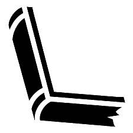

[![Version][versionimage]][changelog]   [![GHUBR][latestreleaseimage]][ghublatestrelease]    

[versionimage]: https://img.shields.io/github/v/release/The-Parable-Collective/Librarium?color=%23aa00aa&include_prereleases&logo=data:image/png;base64,iVBORw0KGgoAAAANSUhEUgAAACAAAAAgCAYAAABzenr0AAAAAXNSR0IArs4c6QAAAARnQU1BAACxjwv8YQUAAAAJcEhZcwAADsIAAA7CARUoSoAAAAR0SURBVFhHzVZtSFtXGM5NosbEJJrEuMRETRs/wbVKmGGTqLUMJnYUEUYFEUHYkLU4+qPrQPzXin+E+WOD/tivgrrB/kw2adNRVrotoghx+NGlXQxCGk2MNX4kMbl7zvUsLEukGdzL9sDhfNz3nvOe933e97yi/xoS2qfQ3NxcoFAolDU1NReCweD5k5MTL/0kPPLz861yufy5wWC4pdPpBrAU7O3tlZ5+FRgdHR1amUzmQ3tWUVFha2pqMkkkEhbKNFERQSCmvWhxcfE2uqPu7u72aDTa0NXVFSgoKPgdLnjvVEJAzM7OMsXFxd6qqqoLRqPxOsMwbH19vQNrXyqVSicVEwScBcRischsNt+H/8OBQGCCZVmR3+9vKywsdMZisZahoSEZJy0kxsbGpLjxJIYsaVDmR7ihLC8vL2kymVo5IQGQ4kBtbW0Cvu+mU1E8HreDgIeIDHckEumky7wjlQd2dnYkPp9vIpFIcGvJZFKKg39Cw1KiDQp9xQkKCSSgp+g4F5AGl9wFKbtghWhnZ2cRkeEbKRcQIO6/p0MOh4eHbeDBzyAls7a29jZd5hVpCuC2D+mQA9zwFtKxGIr9AmUu02VekaaAXq//FZkwTKciJCHJwsKCAxHxGBwQjIhpUKlU36BL8UCtVn9utVovwQqx9vZ2DZHhE2kWIPgnD2CFyzab7SmSVXRlZYX3fJChQF1d3UOSGf/C0dFR7f7+vg6KPUE4vkuXhQV48Bu6lBu0Wu210tLS20VFRWvkO5/IsAABFEh7gAgBKysrHyMSrMgHRrrMC7IqoNFo0sKRmL6srMyFdyG8tLTEKw+yKmC32x/hsCidEh6Ydnd3LVh7gqnw9QEBYv8BOha1QRK+/8JisaiRJ25g/cWpBD9gaJ8BEO9T3PoOXslPoMDX29vbVxGSD7a2ttbxZryEVfzoQ0jTIUTNS8jsQ+Y5ckbM6/W+aGlpeYWHLNDX1xcaGRk5pttm4EwFEPs25P+ehoaGe8vLy48QhlJsVDk/P/++2+3OgzXO4QAl0jWpGd4Ih8MonpTmg4ODQjxeBhCWK3SAKBRNQNaDxy2GS/2B5Bbc29v7kHw8UwGU5UxJSUk+ks8P2PRNEPMKCpNXGxsb/RhHsYEP30OoIUIo34II01BPTw+pI+Nzc3MyuE7lcrn0sJDO4/GUwKIGWEiB/jz2U4yPj380PDwcocdlB2rEd0h9iCr5A5jWDiuQdyKVH/7e8I0l2RK3i2DsxkEuWOJbKHkPJf4EuPMx9huUSqWXBgYG1Pjn9cDB/dhwcXR0VI6bbWAp6+G5NigWr66u7p+amjrT8mlobW01lJeXf4YkdAXTrJvm2oglcQl/Y2NjquzLCXgbLiIEb2KYdeNcGkjK4iL34QoV5mnIyRQoVJjBwUGV0+k0gHR6RIcKpLOgjlRgcxOIpkVYahCK50AwObhgPD7OjDyE9LX19fVpOuWQmy/+BWZmZpjJyUnG4XBop6enNbi1eXNzsxguKMfYs7q6+h0V/T9AJPoTbMzcuJ+QKqUAAAAASUVORK5CYII=

[latestreleaseimage]: https://img.shields.io/github/downloads/The-Parable-Collective/Librarium/total

[changelog]: https://github.com/The-Parable-Collective/Librarium/blob/master/CHANGELOG.md

[ghublatestrelease]: https://github.com/The-Parable-Collective/Librarium/latest

# Librarium
Reusable Common Code and Reduction of Boilerplate.

Please refer to the [wiki](https://github.com/The-Parable-Collective/Librarium/wiki) for documentation, design philosophy, and usage.
